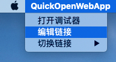

# quick-open-web-links

一个用于打开指定 url 的桌面应用

# 项目创建

该工程使用的 useful-cli(1.0.8 版本)创建

# 下载

可以到 [Release Page](https://github.com/yucheng1207/quick-open-web-links/releases) 下载最新版本安装包，mac 用户下载`dmg`文件，window 用户下载`exe`文件

# 使用

## 添加/编辑新的链接

点击应用左上角 菜单->编辑链接 即可对链接进行管理，点击提交即可设置选中链接为下次启动 app 时默认打开的链接




## 切换链接

可以通过上一步的编辑链接页面选中要切换的链接后点击提交按钮进行切换，也可以直接点击应用左上角 菜单->切换链接。


# 开发

```bash
# 本地调试
yarn dev

# 编译
yarn build:[env]

# 打包应用
yarn pack:[platform]:[env]

# 部署应用，该命令会将release-builds中的内容部署到线上，所以部署前需要先打包应用，部署新版本会触发应用更新
yarn only:publish:app:[env]

# 部署webview(渲染进程)，该命令编译打包渲染进程代码并将其部署到线上，部署新版本会触发热更新
yarn publish:renderer:[env]
```
